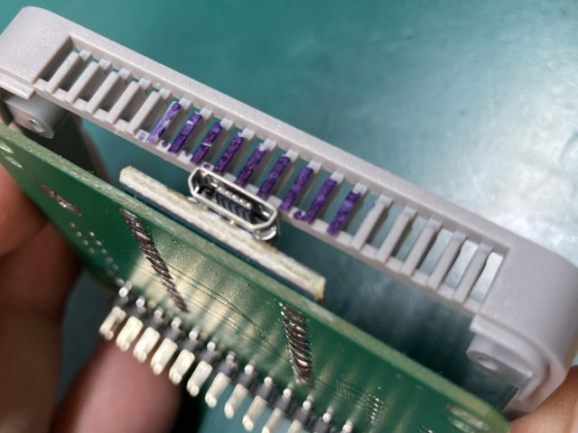

# MSX0 USB-Keyboard Stack 組み立てマニュアル

## パーツ一覧
下記パーツを同梱してあります。不足があった場合は連絡お願いします。  

### ■6.5mm厚キット 

### 付属部品一覧

|Ref No|Part Name.|Qty|備考|
| :- |  :- |  :- |  :- |
|－|専用PCB|1||
|U1|sparkfun pro micro 3.3V 8MHz版 中華互換品|1|当サークルにて動作チェック済|
|CN1|M5純正 SMDピンヘッダー（オス側)|1|裏面実装のため、シルク印字ありません|
|CN2|M5純正 SMDピンヘッダー（メス側)|1||
|-|リードフレーム(24ピン分)|1|U1取り付け時に使用します　|
|-|M5純正 プロトタイプ用プラスチックフレーム|1|　|
|-|六角ネジ2mm |4| 基板固定用|

### ■13mm厚キット 

### 付属部品一覧

|Ref No|Part Name.|Qty|備考|
| :- |  :- |  :- |  :- |
|－|専用PCB|1||
|U1|sparkfun pro micro 3.3V 8MHz版 中華互換品|1|当サークルにて動作チェック済|
|CN1|M5純正 SMDピンヘッダー（オス側)|1|裏面実装のため、シルク印字ありません|
|CN2|M5純正 SMDピンヘッダー（メス側)|1||
|CN3|DSUB9ピンコネクタ (オス)|1||
|IC1|74HC4050相当品|1||
|RN1|抵抗アレー10k x 6素子|1|在庫の都合で10k x 8素子の場合があります|
|-|リードフレーム(24ピン分)|1|U1取り付け時に使用します　|
|-|専用13mm厚フレーム|1| 3Dプリント品　|
|-|ネジ2mm |4| 基板固定用|

## 組み立て時の注意点 (6.5mm厚/13mm厚 両方)

M5 Stackの制約として、ピンヘッダ側の凸部が2mm以下する必要があるようです。  
DIP部品を半田付けする場合は、基板面ギリギリまで部品の足をカットし半田付けしてください。  

特に、D-SUBの固定金具は大きく飛び出るのでカットを忘れない様にしてください。

## 基板の組み立て(6.5mm厚)

### 1．U1に裏面からリードフレームを挿入します。

※耳の部分は後で折り取ります。  
  

### 2．U1にpro microを挿入し、ハンダづけします。  

出来るだけピンが飛び出ない様にしてください。  
ハンダ付け前に折り曲げてカットしておくと見た目が綺麗です。 

  

### 3．リードフレームの数回曲げて耳を折り取り、ハンダづけします。

曲げるのが堅い場合は、4ピンずつぐらいに分割してから曲げるとやりやすいと思います。

  

### 4．CN2 15x2コネクタ(メス)をハンダづけします。

位置合わせの基板の穴とコネクタのポッチを合わせて半田付けします。　　
  

横からみた時は、このような感じになります。  
ハンダ量が多いとコネクタの端子までハンダが上がってくる事があるので、少量で手早く半田付けしてください。
  

### 5．CN2 15x2コネクタ(オス)をハンダづけします。  

位置合わせの基板の穴とコネクタのポッチを合わせて半田付けします。  
コネクタが若干ずれやすいので注意してください。  
ここまで完了したら基板は完成です。引き続きフレームの加工を行ってください。  
  

## フレームの加工(6.5mm厚)

基板の形状に合わせ、M5純正 プロトタイプ用プラスチックフレームの加工を行います。  

### 1．U1とフレームが干渉する部分をカットして折り取ります。  

マジックで着色している部分がカットする部分です。  
縦溝5つ分を左右に残す感じで、フレーム上をニッパーなどでカットし、  前後に曲げて折り取ります。  
  

### 2．付属の六角ネジでフレームに基板を固定します。  
付属のネジをつかい基板をフレームに固定します。  
(1.5mmの六角レンチはM5に付属しています）  

完成です。次にArduinoスケッチの書き込みをおこなってください。

## 基板の組み立て(13mm厚)

### 1．U1に裏面からリードフレームを挿入します。

※耳の部分は後で折り取ります。  
  

### 2．U1にpro microを挿入し、ハンダづけします。  

出来るだけピンが飛び出ない様にしてください。  
ハンダ付け前に折り曲げてカットしておくと見た目が綺麗です。 

  

### 3．リードフレームの数回曲げて耳を折り取り、ハンダづけします。

曲げるのが堅い場合は、4ピンずつぐらいに分割してから曲げるとやりやすいと思います。

  

### 4．IC1 74HC4050/RN1 10KΩをハンダづけします。

いずれのパーツも向きがあるので、注意してください。    
  

### 5．CN3 15x2コネクタ(メス)をハンダづけします。

位置合わせの基板の穴とコネクタのポッチを合わせて半田付けします。  
近傍のD-SUB9ピンのネジ穴にハンダが誤って乗りやすいので、事前にマスキングした方が良いと思います。  
   

### 6．CN3 DSUB9ピン2コネクタ(オス)をハンダづけします。

裏面への飛び出し量に注意してください、ツメの金属は硬いのですが、頑張ってカットしてください。DD
   

### 7．ハンダ面にCN2の15x2コネクタ(オス)をハンダづけします。  

位置合わせの基板の穴とコネクタのポッチを合わせて半田付けします。  
コネクタが若干ずれやすいので注意してください。  
ここまで完了したら基板は完成です。引き続きフレームのネジ止めを行ってください。  
 　

## フレームへの固定(13mm厚)

基板をフレームにネジを使い固定します。  
フレームの穴を基板の穴と合わせて、付属ネジで適切なトルクでねじ込み固定してください。  
フレームは3Dプリント品のため、ゆがみが有る場合がありますが、ネジで固定すると修正されます。  
   

完成です。次にArduinoスケッチの書き込みをおこなってください。  
  

## Arduinoスケッチの書き込み

ボード設定、スケッチのコンパイルと書き込みの順に進めていきます。  
なお、Arduinoのインストールや細かい使い方はここでは割愛します。  

### 1.　sparkfun pro micro のボード設定ファイルをインストール  

Arduino.cc公式のボードでは無いため、ボード設定が必要になります。  

[ファイル]→[環境設定]→[追加のBoard Manager]に下記を入力

`https://raw.githubusercontent.com/sparkfun/Arduino_Boards/master/IDE_Board_Manager/package_sparkfun_index.json`

[ツール]→[ボード]→[ボードマネージャー]を開いて、"sparkfun"を検索。

SparkFun AVR Boardsのパッケージをインストールする。

参考：
https://learn.sparkfun.com/tutorials/pro-micro--fio-v3-hookup-guide#windows_boardaddon

### 2.　ボードとCPU設定
ボードをsparkfun Pro Microに設定します。  
プロセッサー設定は3.3V 8MHzのボード設定をします  

### 3.　プログラムのコンパイルと書き込み
COMポートをUSBシリアルの番号に設定してください。  
「マイコンボードに書き込む」のアイコンをクリックし、プログラムの書き込みを完了してください。  

  

これで準備が完了しました。

## 動作チェック  

### USB Stackの動作確認
上から[M5 Core2 (MSX0)]→[本Stack]→[M5 USB Host Shield]順にスタックしてください。  
　

次にUSBキーボードをUSB端子に接続してください。  

MSX0の電源を入れるとUSBキーボードでキー入力が可能です。  
なお、無線タイプの場合、キーボードの初期化時間の都合で認識出来ない場合があります。  
その場合は、MSX0のリセットボタンを一度押してみてください。  

### MSXジョイスティックポートの動作確認(13mm版のみ)
USB端子に何も接続していないとき、またはUSB Stackを重ねない場合に、  
本機のMSX仕様のジョイスティック端子が使えます。  
このモードで、すべての方向とTrig0/1がすべて問題無いか確認してみてください。

## 動作確認ソフトについて
動作確認ソフトとして、MSXのキーマトリクスを直接読み取り、キーの状態を確認するツール  
MSXDOSで動作する「keydump.com」を同梱しています。  

https://github.com/v9938/MSX0_USBKEYBOARD/tree/main/MSXKEYDUMP

