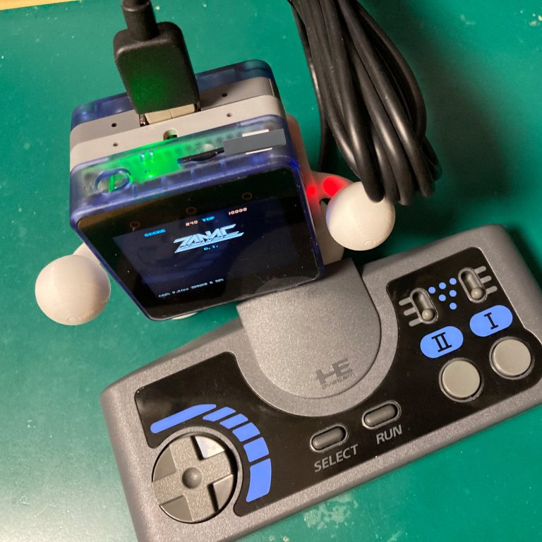

# MSX0 USB-Keyboard MBUS Stack  

  

  

MSX0 USB-Keyboard MBUS Stackは、別売のM5 Stack USB Module with MAX3421Eと一緒に使用することで  
M5 Faces Keyboard または Game Padと同等の機能を、USBキーボードやゲームパッドで実現するStackです。  
MSX0のKEYBOARDモードおよびGAME PADモードの両方に対応しています。  

## ■ MSX0製品版への対応について
(10/26更新）  
MSX0製品版(ver:0.05.04)への本製品の対応ですが、新しいスケッチに更新することで対応可能です。  

### Firmware (USB KEYBOARD版)
[USB KEYBOARD/MSX JOYSTICK対応版 Firmware](./Arduino/USBHIDBootKbd_MSX0/)  

### 仕様上の制約について
動作は旧KEYBOARD仕様に準拠するため複数キーや押しっぱなしのキー認識が出来ません。  
また、MSX0の仕様上、旧キーボードモードでは本体Grove I2C_A端子との併用ができません。  
（Device I/O Error、またはMSX0の動作が止まります)

なお、新キーボードモードへの対応はKEY割り込み通知の信号が物理的に変わってしまったため、  
当該アダプタでは対応が不可能です。新基板にて対応を計画しています。ご了承ください。  

### キーボードモードとゲームパッドモードの切り替えについて
USBキーボードを接続していない場合やM5 USBモジュールを接続していない状態で起動した場合は  
GamePadモードになります。電源が入った状態で、USBを抜差すると一時的に動作がおかしくなる場合が  
ありますが、その際はMSX0をリセットしてください。  

## ■ 2種類のStack
頒布しているStackは、13mmと6.5mmの厚みが異なる2種類を頒布しています。  
この2つのStackは使用するFirmwareは一緒ですがMSX仕様のジョイスティック対応の有無の差があります。

### 共通機能  
USB KEYBOARD/JOYSTICK → MSX0 Keyboard変換  

### 6.5mm厚Stack
Socketの高さが違います(M5Stack用2 x 15ピンソケット)  
付属フレームがM5純正の成形品です　(M5 Plastic Frame for Proto Module)  

### 13mm厚Stack
MSX仕様JOYSTICK(DSUB9ピン) → MSX0 GamePad変換機能が追加されます。  
当該機能はStack単体でもMSX仕様のJOYSTICKの変換として使用することができます。  

Socketの高さが違います(M5-13.2モジュール用 ソケット)  
付属フレームは、オリジナルの3Dプリント品になります。　　

## ■ 使用イメージと基板写真

   
   

実際の動作は下記URLを参照してください。  
<https://twitter.com/i/status/1641843307184799746>  
<https://twitter.com/i/status/1641485580763807744>  

## ■ MSX0のキーボード実装仕様について   
現在配布中のMSX0では、MSXキーボードのキーボードについて全キーの割り付けがされていません。  
キーボードモードでは16msのみ当該キーがトグルされる仕様になっています。  
またゲームコントローラーモード以外で複数キーの同時入力および押し続けを行う事ができません。  

出来る限りオリジナルに近いキー配置や操作感にしたいのですが、MSX0の仕様により全く異なる操作感  
になる事をあらかじめご了承ください。  

本問題については、MSX0側の改良で改善される場合は本Stackも対応したいと思います。

## ■ MSX0のキーコード表   
本機は、以下のキーコード表を元に設計しました。  

#### I2Cアドレス 0x08　　
  
[キーマップ (EXCEL形式)](./img/MSX0KEYTABLE.xlsx)
## ■ USBキーボードについて   
日本語対応USB 108/109キーボードに対応しています。  
Logicool社のUnifyingでの動作も確認できていますが、  
当該レシーバのように電源投入から立ち上がりが遅いキーボードは、  
電源投入直後のみ誤ってゲームパッドモードで認識される場合があります。  

その場合は、MSX0側のリセットボタンを押してMSX0を再起動するか、  
Configのキー設定をキーボードモード固定してください。  

<!-- 写真： -->

### 動作確認済みUSBキーボード
hp USBスリムスタンダードキーボード(日本語版109Aキーボード) N3R87AA#ABJ  
MSソリューションズ　MS-USBKBJP109BK  
Logicool Wireless Touch Keyboard K400  
Microsoft Wired keyboard 600
東プレ REALFORCE 108UBK SJ08B0  

## ■ USBゲームコントローラについて   
USBキーボード対応とファームが異なりますのでこちらを使う場合はファームを書き換えてください。  
USBゲームコントローラは以下の機種に対応しています。

### 動作確認済みUSBゲームコントローラ
SEGA Genesis Mini 3-Button Classic Controller MK-16500  
SEGA ファイティングパッド6B HAA-2552  
KONAMI(HORI) PCエンジンminiコントローラー HTG-002  
KONAMI(HORI) ターボパッド for PCエンジン mini HTG-003  
KONAMI(HORI) Core Grafx Mini mini Turbo Controller HTG-006  
SONY プレイステーション クラシック付属コントローラ SCPH-1000R  
8BitDo SN30 Pro  
SEGA アストロシティミニ コントロールパッド  
TAITO イーグレットツーミニ コントロールパッド  
TAITO イーグレットツーミニ コントロールパネル  
Matflash F300 Elite  
SONY PS4 DUALSHOCK 4 (CUH-ZCT2J)  
HORI FIGHTING STICK MINI  

## ■ 頒布するキットについて   

本製品は原則半田付けが必要なキット形式の頒布になります。  

家電のKENちゃん、SwitchScienceさんにて取り扱い予定です。  
配布の形態は、下記2形態になります。  

#### フルキット（基板 ＋ pro micro互換品 ＋その他パーツ ＋フレーム）
必要なパーツも、すべてセットになったキットです。  
パーツのハンダ付けとファームウェア書き込みの為にArduinoの開発環境が必要です。  

M5 Stack USB Moduleは別途購入してください。  
<https://shop.m5stack.com/products/usb-module>  
<https://www.switch-science.com/products/6061>  

#### 完成品（半田付け済、M5 Stack USB Module付属)
家電のKENちゃんのみの扱いになります。  
組み立て済で直ぐ使える状態になっています。  

## ■ 頒布先   

### フルキット
### ○6.5mm厚 USBのみ対応

#### Switch Science  
URL未定
<!-- <https://> -->

### ○13mm厚 MSX規格ジョイスティックポート有り

#### Switch Science  
URL未定
<!-- <https://> -->

### 完成品
### ○6.5mm厚 USBのみ対応
#### 家電のKENちゃん  
<https://www.kadenken.com/view/item/000000001590>

### ○13mm厚 MSX規格ジョイスティックポート有り
#### 家電のKENちゃん  
<https://www.kadenken.com/view/item/000000001589>

## ■ 組み立て説明書について  
準備中です。
<!-- 下記を参照ください。  
[組み立て説明書](./AssemblyManual/Assembly.md) -->

## ■ 動作チェックソフト  
下記ツールでMSXからキーボード各キーの押した状態の確認を行う事ができます。  
[MSX-DOS KEYMATRIX チェックツール](./MSXKEYDUMP/keydump.com)

## ■ 本機の仕様について

|仕様  | 詳細 |
| - | - |
| 対応規格 | M5 module MBUS準拠 |
| Series Protocol | I2C Address 0x08 |
| 搭載マイコン | Atmel ATMEGA32U4 (3.3v 8MHz仕様) |
| 定格 | 5V 30mA (M5 Stack USB Moduleセット時)|
| 入出力端子 | micro USB B端子 (Firmware書き込み用、MSX0に電源供給可能)|
|  | MSXジョイスティック端子 (13mm厚のみ対応)|

## ■ 設計データ

### Firmware (USB KEYBOARD版)
[USB KEYBOARD/MSX JOYSTICK対応版 Firmware](./Arduino/USBHIDBootKbd_MSX0/)  
[USB KEYBOARD MSX0JOYPADモード Firmware](./Arduino/USBHIDKbd_MSX0_PADMODE/)  

### Firmware (USB JOYSTICK版)  
[USB JOYSTICK対応版 Firmware](./Arduino/USBHIDPad2MSX0/)  

### Firmware (組み立て動作チェック用)  

ひたすら'MSX0 'と入力されます。  
[組み立て動作チェック用 Firmware](./Arduino/TEST_MSX0KEYPADMode/)  

### 回路図
[回路図 (PDF版)](./PCB/KEYBOARDSTACK_Schematic.pdf)  
  

<!-- ### パーツリスト -->

### 基板
[PCB (PDF版)](./PCB/KEYBOARDSTACK_PCB.pdf)  
   
### 13mm厚フレーム  
[STLデータ](./PCB/Frame/m5stack-Stack.stl)
